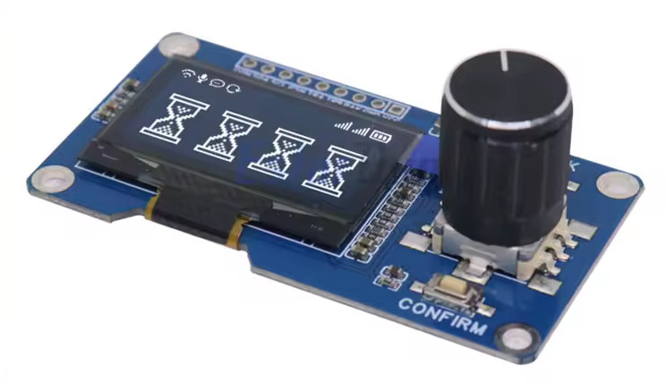
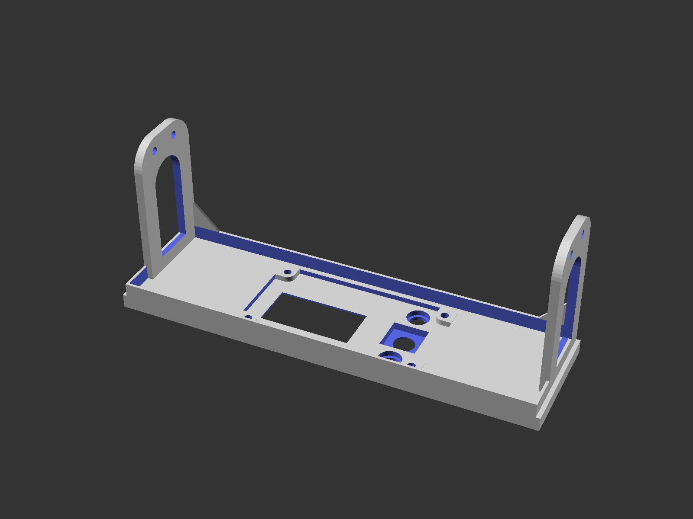
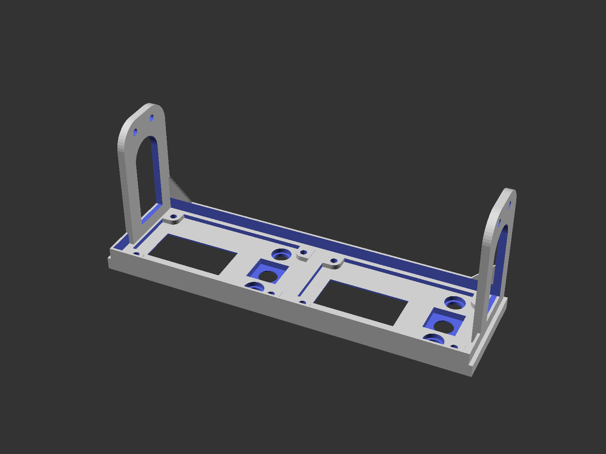
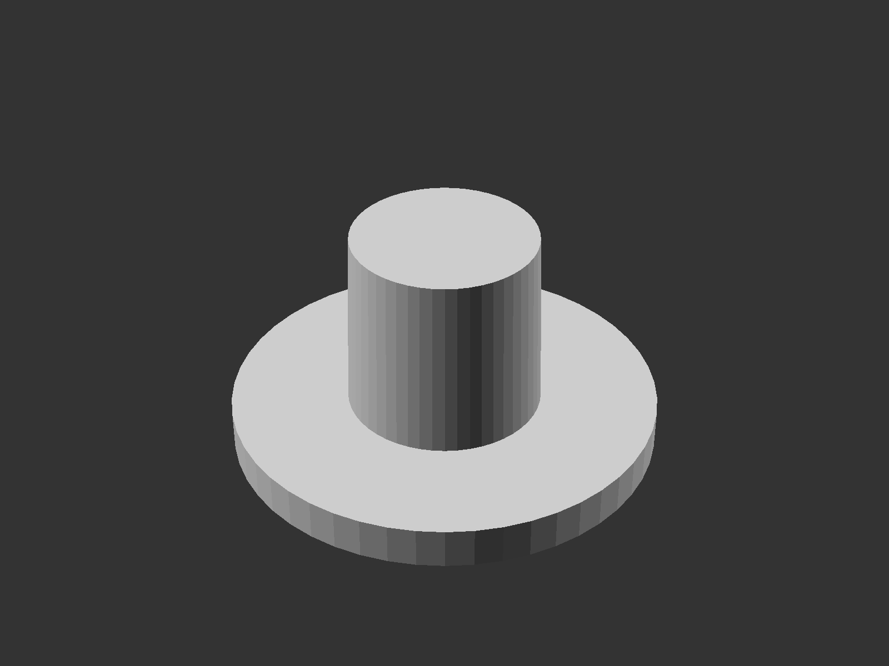

# 5.25" Single/Double OLED Control Panel

## Summary

This is panel for the EstarDyn OLED + rotary encoder + buttons controller board available on [AliExpress](https://www.aliexpress.com/w/wholesale-Estardyn-1.3%2525252dinch-OLED-Module.html). 

There is both a single and double version.

## Notes

Requirements for each controller board:

* 4 x 3M4 screws for mounting the controller PCBs
* 2 x Ø5.5mm button caps with Ø7.5mm rim (use the button inserts for hollow caps)

