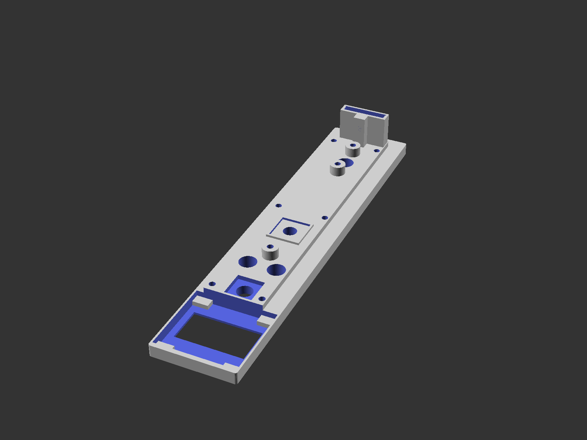
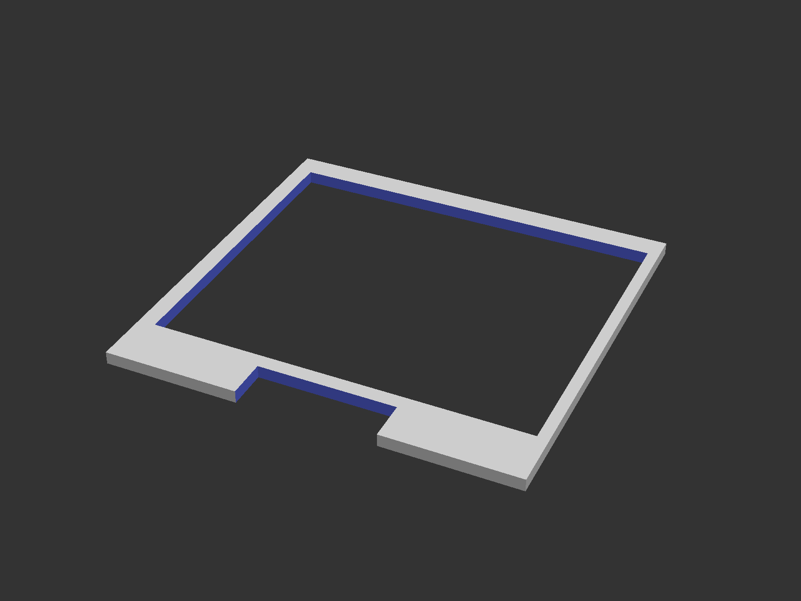
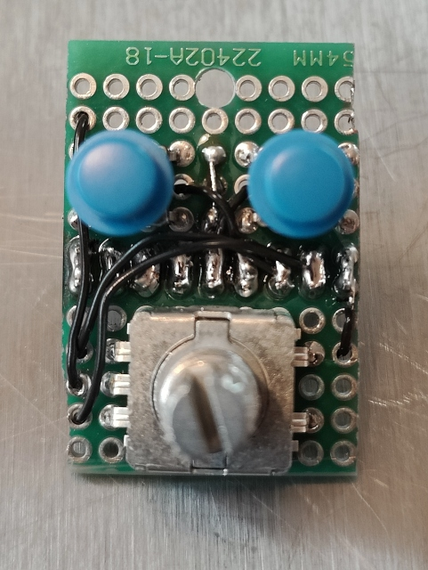
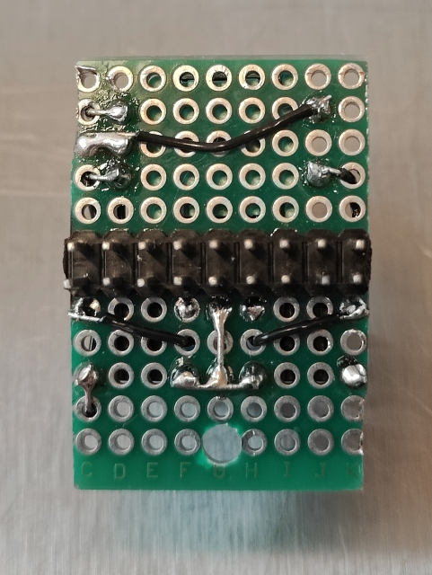
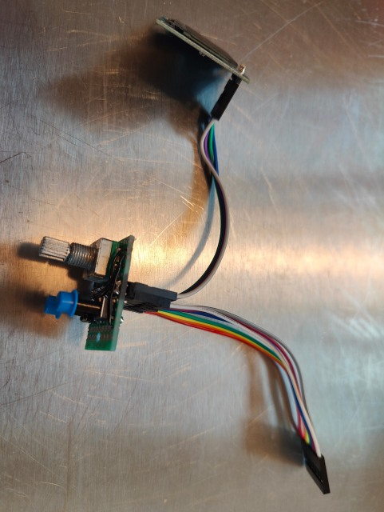
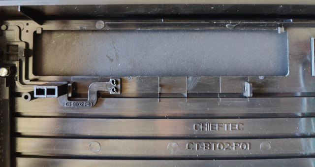
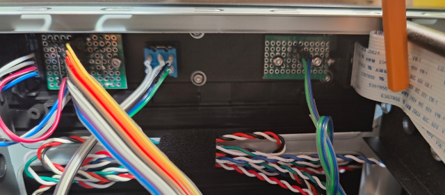
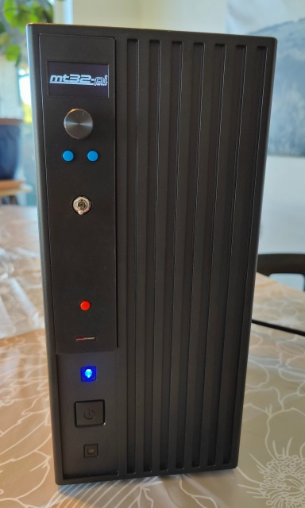
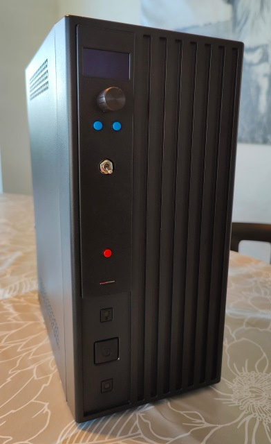

# Front panel for the Chieftec BT02 chassis

This model is available on [Thingiverse](https://www.thingiverse.com/thing:).

## Summary

While building an [ITX-Llama](https://docs.retrodreams.ca/itxllama/) system using a [Chieftec BT-02B](https://www.chieftec.eu/products-detail/93/BT-02B-U3-250VS) case, I was missing a few buttons and knobs on the front, hence this build.

This project is a new 5.25"-ish front panel for the BT-02 that fits in the optical drive opening. No cutting or breaking of the original case required. The new front plate has controls for the MT32-Pi, a switch for selecting the MT32-Pi or the GS Wavetable board, a reset button and a MicroSD slot.

## Requirements

You'll need these parts for the build:

* MT32-Pi control board:
  * 9x12 hole Stripboard/Veroboard with 2.57mm spacing
  * 1 x Rotary switch with Ø6.75 stem and 12x12mm box with no tap (standard China model also used in Gotek projects)
  * 2 x PCB buttons with 9mm stem and total height of 13mm
  * 2 x hats for buttons (Ø5.5mm)
  * Knob for rotary button
  * Pin header, depending on your design choice (I used 2x9 to be able to daisy chain the OLED)

* Reset switch board:
  * 3x8 hole Stripboard/Veroboard (as above)
  * 1 x PCB button (as above)
  * 1 x hat for button (see above)
  * Pin header, depending on your design choice (1x2)

* 10 x 3M6 screws (head Ø5.5mm max.)
* 6 x 3M washers
* 1 x flip switch for switching between MT32-Pi and GS WaveTable audio with Ø5.75mm stem and 12.75x13mm box and no tap.
* 1 x MicroSD card extension wire

## Notes

* Remember the OLED spacer.
* Don't tighten the screw securing the MicroSD adapter - the tip should just overlap and secure the metal case.
* Be careful with the MicroSD ribbon cable - it's a little fragile, especially around the socket.
* Fit the build in the front before attaching the MT32-Pi control board.
* When drilling holes in the PCBs, use a 4mm hole for a little whiggle room.

### MT32-Pi

This was originally built for the [ITX-Llama](https://docs.retrodreams.ca/itxllama/), which shared the same pinout for the controls as the [WP32 McCake](https://www.serdashop.com/WP32-McCake) described below:

| Pin | Signal                      |
| --- | --------------------------- |
| 1   | SDA (typically for OLED)    |
| 2   | SCL (-"-)                   |
| 3   | VCC (3V3)                   |
| 4   | GND                         |
| 5   | B1 (Synth mode toggle)      |
| 6   | B2 (ROM/Soundfont selector) |
| 7   | B3 (Rotary turn)            |
| 8   | B4 (Rotary turn)            |
| 9   | B5 (Encoder push)           |

The 128x64 OLED pinout is usually like this:

| Pin | Signal    |
| --- | --------- |
| 1   | VCC (3V3) |
| 2   | GND       |
| 3   | SCL       |
| 4   | SDA       |

Note that this is NOT the same at the 9-pin connector, and you'll need to twist VCC and GND if you're connecting the OLED directly to the MT32-Pi device.

Building the PCBs is left as an exercise for the reader. I did a sort of daisy chain thing with a 2x9 pin header, so there's a ribbon cable from the audio device (in this case the motherboard) to the buttons/rotary encoder and from there, a ribbon cable to the OLED.

## Screenshots

