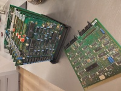
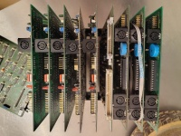
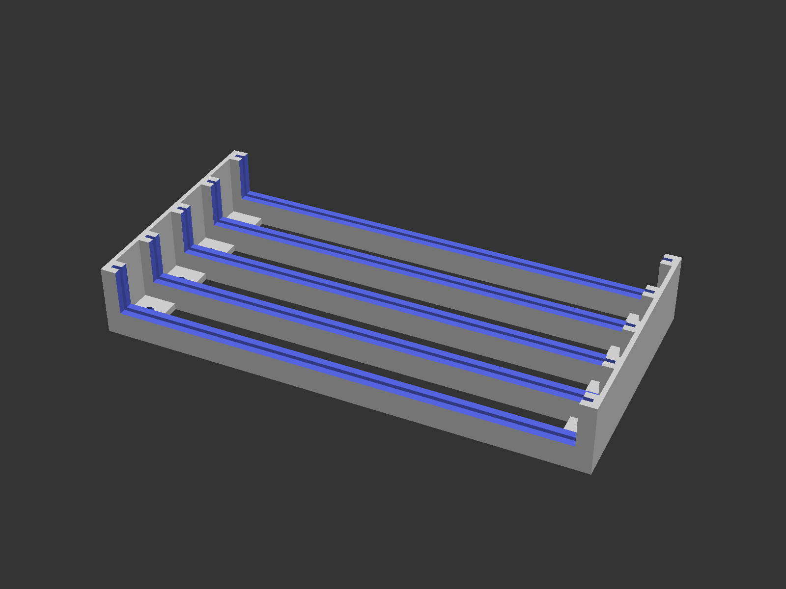
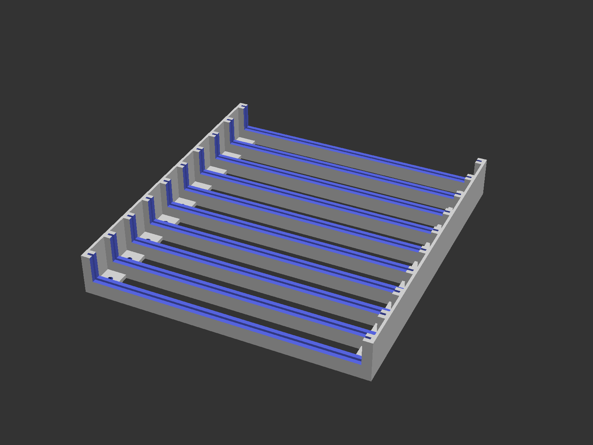

# Gemini/Nascom 80-Bus Stop

A storage rack for the Gemini/Nascom 80-Bit Bus cards.

This model is available on [Thingiverse](https://www.thingiverse.com/thing:7258329).

## Summary

A rack-like mount for 80-Bus cards for the Gemini/Nascom microcomputers. Has holes for mounting. Available in different versions with different number of slots.

