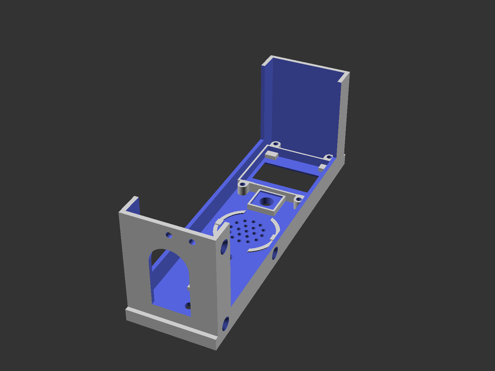

# Gotek 5.25" Vertical Mount

This model is available on [Thingiverse](https://www.thingiverse.com/thing:6939095).

## Summary

This is an alternative 3-part enclosure/case/mount for a Gotek floppy emulator running the FlashFloppy firmware. It's designed to match the style of early 80s microcomputers, with the OLED being a noticeable but rather convenient exception.

If you build and use this in an old system, please post pictures! :-)

Parts needed:

- 1 x Gotek floppy emulator (see photo - unsure if other versions will fit - please report back)
- 1 x 1.3" I2C 128x64 monochrome OLED display (the one with a 4-pin header at the top - available on AliExpress etc.)
- 1 x Rotary encoder with 12x12mm body (model without nudge/peg)
- 1 x 5mm red LED
- 1 x 27mm piezo buzzer
- 4 x M3x6 screws (for mounting the OLED cover)
- 5 x M3x6/8 screws (for mounting the PCB)
- 3 x M3x5 sunken head screws (for mounting the PCB tray to the case)
- Wires for connecting everything

Assembly:

- Prepare PCB (remove from original case, remove original LED, optionally solder in pin headers)
- Attach OLED display and secure with the OLED cover piece
- Attach components to base (rotary encoder, piezo buzzer, LED)
- Mount PCB on tray and attach to base

For details on connecting the components, see https://github.com/keirf/FlashFloppy/wiki/Hardware-Mods

I'm not affiliated with Gotek Systems in any way.

## Screenshots

