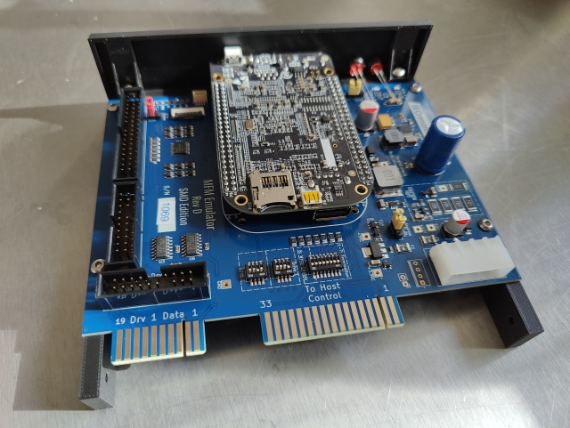

# Alternative 5.25" mount for DECromancer's MFM Emulator

This model is available on [Thingiverse](https://www.thingiverse.com/thing:6978774).

## Summary

[DECromancer](https://decromancer.ca/) sells a mount/bracket for their [MFM Emulator](https://decromancer.ca/mfm-emulator/),
but it didn't quite match the style I was going for, so I designed an alternative version. This fits the *Rev D SMT* version of the PCB.

The front plate dimensions are inspired by the NEC D5126 hard drive that the MFM Emulator will be replacing. That means the front panel sticks out 3-4mm more than DECromancer's and is slightly wider, preventing it from sliding back into the machine if not mounted.

A cutout was made on the right rail, around the *Supercap* power circuit. This area gets very hot, and I didn't want it touching the filament directly. You'll need a metal riser/spacer for the PCB screw there.

Goals were an early/mid 80s front plate esthetics and ability to safely use the board outside the computer without risk of easily short circuiting it. Saving filament was not a priority.

## Requirements

You'll need these parts for the build:

* 2 x 5mm LEDs - one for each drive
* 2 x 3M8-10 for mounting the front plate
* 4 x 3M4-6 for mounting the PCB
* 1 x 3M8 metal riser/spacer for hot area of PCB

## Screenshots

