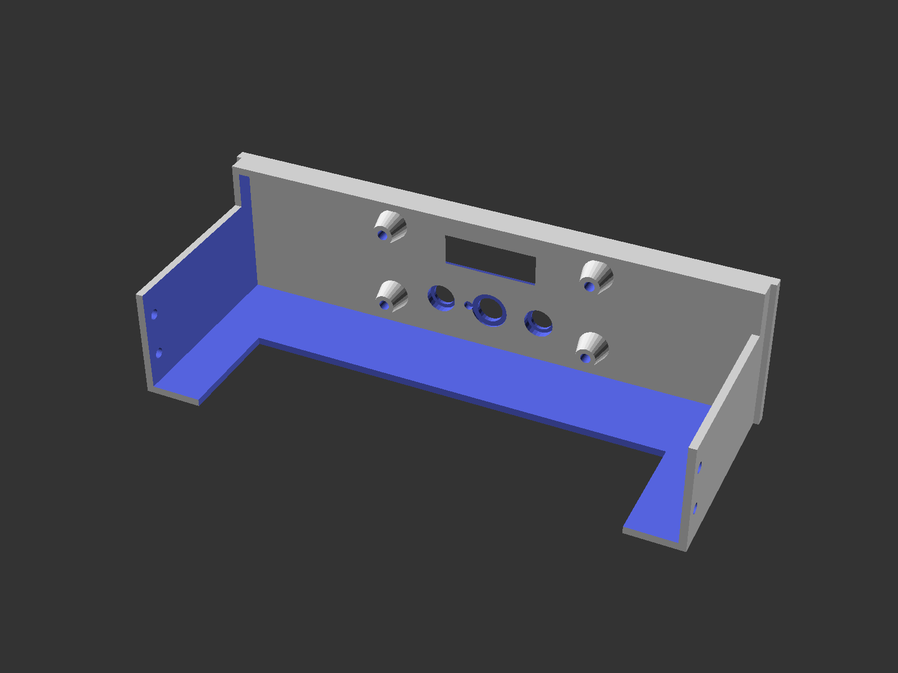

# 5.25" bay MT32-Pi control panel

Simple control panel for MT32-pi, featuring an 128x32 pixel OLED, two buttons with "hats" and a rotary encoder, mounted on a PCB. My first 3D model.

Solderes PCB. Not pretty but works. 9 pin header on the back, compatible with the [WP32 McCake](https://www.serdashop.com/WP32-McCake).

Finished and mounted. Wrong filemant color and printed knob, which turned out to be a bad idea.

## References

- https://www.thingiverse.com/thing:5279717
- https://www.serdashop.com/WP32/MT32Pi-Drive-Bay-Panel-5.25-with-OLED-display-buttons
