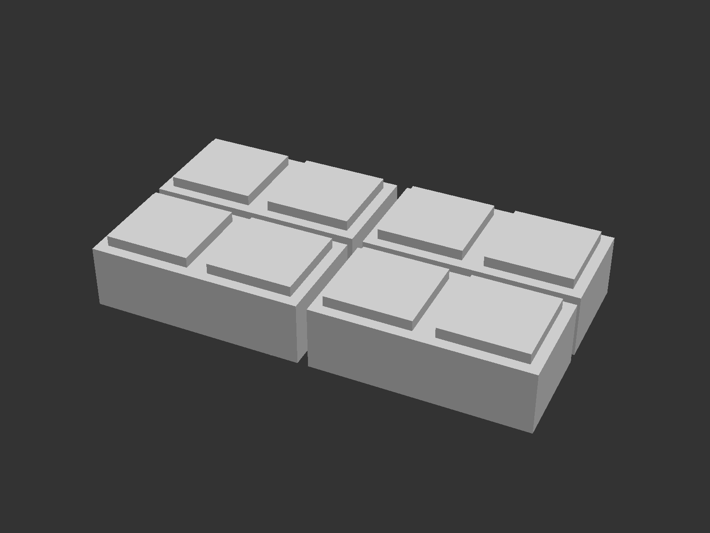

# The "Original" LEGO Brick

.. is perhaps not the correct name for this project, but supposedly this is the brick that Ole Kirk Kristensen received as a production sample from the plastic molding machine that inspired him to start producing the LEGO bricks we know today.

The brick is designed after [this scene](https://youtu.be/qr_dTySMl7s?si=LExK1rWJDW-SwywL&t=479) from LEGO's animated movie [The LEGO Story - How it all started](https://youtu.be/qr_dTySMl7s?si=LExK1rWJDW-SwywL). It is scaled as a regular 2x4 brick according to [this StackExchange answer](https://bricks.stackexchange.com/a/298).

I'm by no means a LEGO expert, but my son needed these for a school project, so naturally I obliged.

