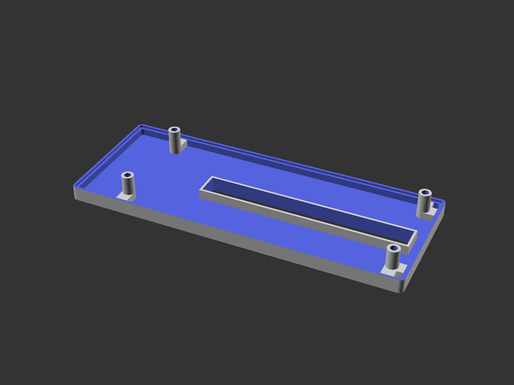
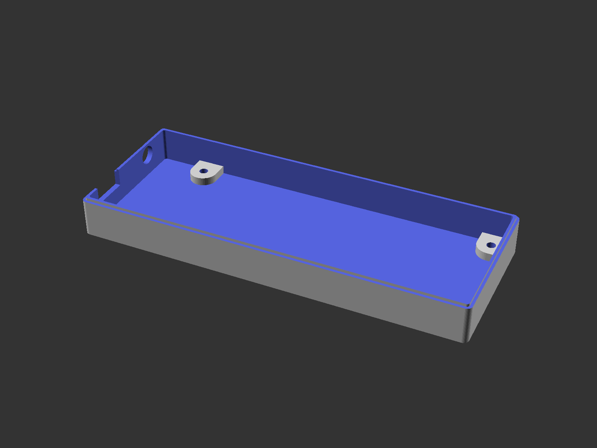
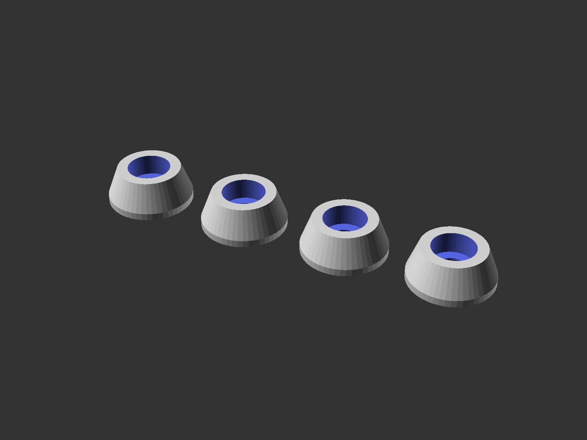
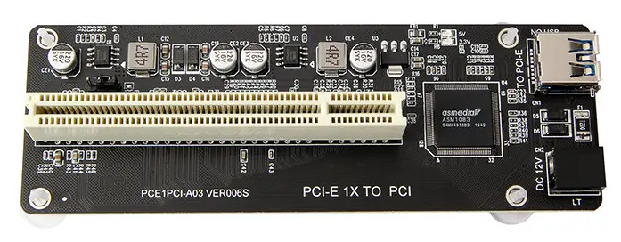
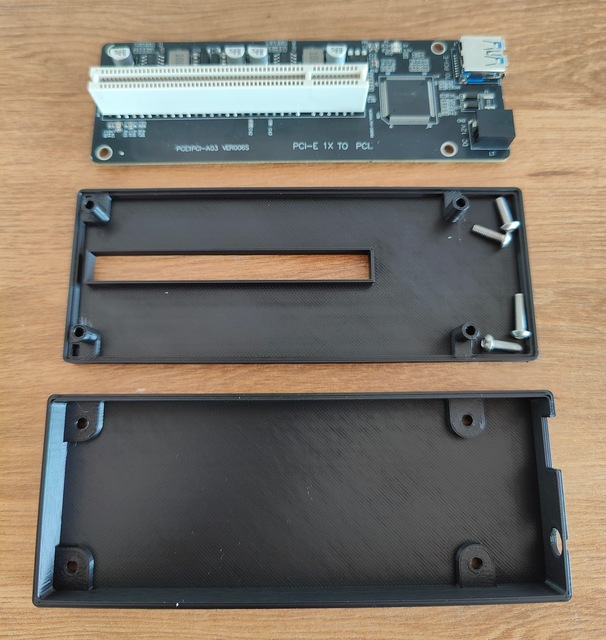
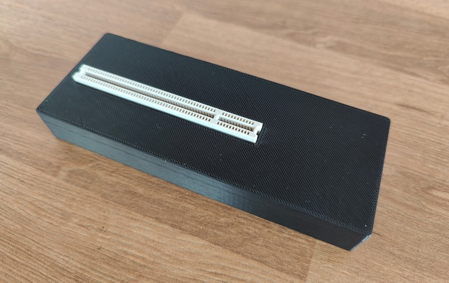
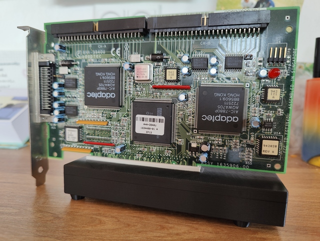

# Enclosure for "PCI-E 1X TO PCI" adapter

This model is available on [Thingiverse](https://www.thingiverse.com/thing:6989515).

## Summary

This is an enclosure for the [PCI-E 1X TO PCI](https://www.aliexpress.com/item/1005005041191544.html) adapter available in multiple Chinese stores online. There are multiple versions available, so make sure you've got the right one.

On a flat surface, the bracket from the PCI card will prevent the enclosure from standing flat. Add the optional feet to get 5mm extra clearance for the bracket. You'll need slightly longer screws when using the feet.

## Requirements

You'll need these parts for the build:

* 4 x 3M8-12 screws (M3x18 if you plan to use the feet)

## Notes

If you're using a power hungry PCI card, consider supplying the board with 12V. Potential heating issues from the PCB power circuit have not been considered - please don't leave the adapter powered on and unattended.

## Screenshots

