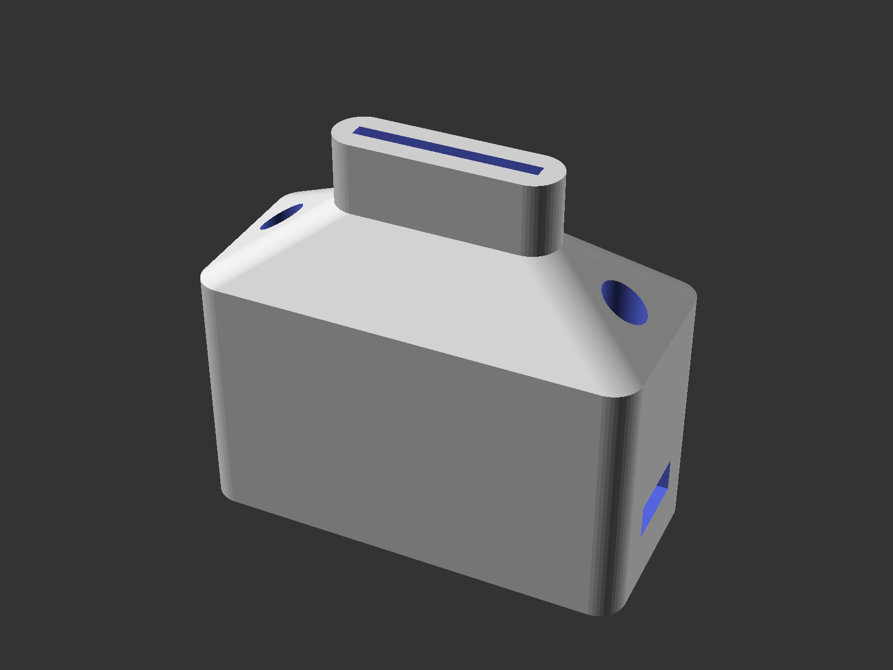
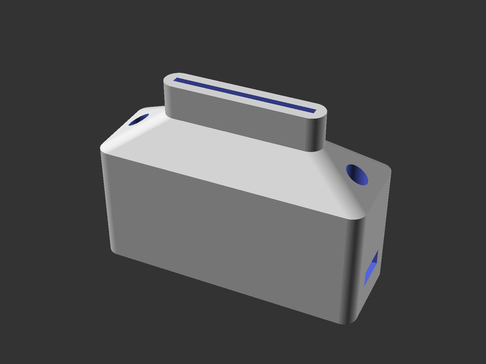
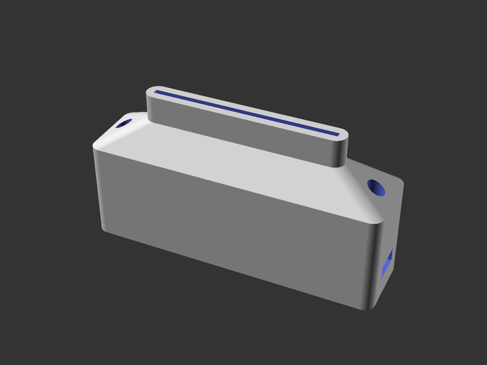
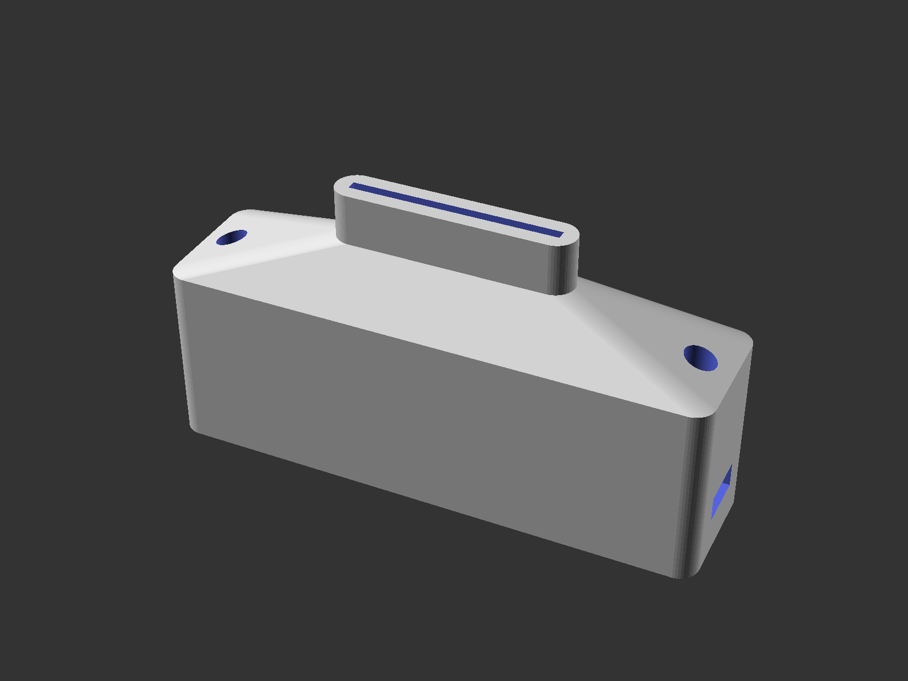

# Ribbon Cable Chassis Connector Housings

This model is available on [Thingiverse](https://www.thingiverse.com/thing:6953672).

## Summary

While restoring an old CP/M system, I found that one of the most fragile parts were the IDC-to-DB25 and IDC-to-Centronics ribbon cables that went from the various expansion cards to the chassis. Not the simple 1:1 crimped cables, but the ones with Centronics or DB-25 connectors soldered by hand, for instance for RS-232 or parrallel printer ports. These are often a bit of a birds nest, with a couple of wires taking most of the load if the cable is accidentally pulled.

These inside-the-chassis connector housings should fix the issue.

For the best fit, print a connector with the proper number of ribbon cable wires.

Screw holes are all the way through, as it has proven difficult to get supports out otherwise.

Parts needed:

### DB connectors

- 2 x 3x10M screws
- 2 x 3M nuts

### Centronics connectors

- 2 x 2.5M screws
- 2 x 2.5M nuts

## Example

## Screenshots from OpenSCAD

